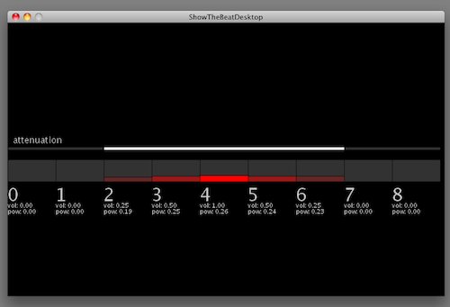

cacophony
=========================

I am exploring the limits of listening to and pinpointing multiple simultaneous sounds.

I took short clips from 10 songs, I then play 9 clips simultaneously, and visualize their power meters in realtime.
The center square is the loudest and comes out both left and right channels.
Tracks to the left are panned left and tracks to the right are panned right.
Tracks are attenuated in volume with distance from center.

You can adjust how much to the left and right of you, you can hear, and select any track to make it become the new center.

### Maxim Fork
I have modified the Maxim library to use a stereo sound system and allow for panning mono tracks
to left or right.

